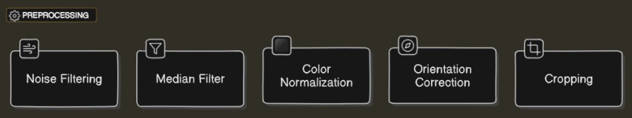

# Arabic Font Classifier

In this project, we developed a system to classify Arabic text paragraphs into four different
fonts using Support Vector Machines (SVM) which achieved 98.5% accuracy on the test set.

The ability to automatically classify text into font types can be useful for tasks such as font recognition, document analysis, and
optical character recognition (OCR) systems.

## Table of Contents
- [Project Pipeline](#project-pipeline)
- [Preprocessing Module](#preprocessing-module)
- [Feature Extraction Module](#feature-extraction-module)
- [Model Training Module](#model-training-module)
- [Performance Analysis Module](#performance-analysis-module)
- [Conclusion](#conclusion)
- [Contributers](#contributers)

## Project Pipeline
The project pipeline consisted of the following stages:
1. Preprocessing: We applied noise filtering, enhanced the median filter, ensured a
white background with black text, rotated the image, and cropped the image to
only the text area.
2. Feature Extraction: We used Scale-Invariant Feature Transform (SIFT) and Bag
of Words techniques to extract features from the preprocessed images.
3. Model Training: We trained an SVM classifier using a dataset of 4000 words,
with 1000 words for each of the four font types.
4. Performance Evaluation: We evaluated the performance of the SVM classifier
using cross-validation on the dataset.

## Preprocessing Module
During the preprocessing stage, we applied several techniques to prepare the text images
for feature extraction and classification. These techniques included:
• Noise filtering to enhance image clarity.
• Applying a median filter to further refine the image quality.
• Ensuring a uniform white background with black text for consistency.
• Rotating the image to the correct orientation for better readability.
• Cropping the image to focus on the text area, excluding any extraneous elements

  </img>

  <em>Preprocessing Stages</em>

## Feature Extraction Module
We employed two main techniques for feature extraction: Scale-Invariant Feature Transform (SIFT) and Bag of Words (BoW).
• Scale-Invariant Feature Transform (SIFT): SIFT is particularly effective because it is invariant to scaling, rotation, and translation, making it robust in various
scenarios. SIFT works by identifying key points in an image, known as keypoints,
and then describing the local image information around each keypoint using a descriptor. These descriptors are highly distinctive and can be matched across different
images, allowing for robust feature matching and recognition.

• Bag of Words (BoW): BOVW represents an image as a histogram of visual
words, which are essentially a set of representative features extracted from local
image patches. The process involves clustering these features into a predefined
number of visual words using techniques like k-means clustering. Each local feature
in the image is then assigned to the nearest visual word, and the histogram counts
the frequency of each visual word in the image. This histogram representation
simplifies the image while preserving important information about its content and
spatial layout, making it suitable for tasks like image categorization and similarity
matching.

 </img>

  <em>Feature Extraction Stages</em>

## Model Training Module
We trained a Support Vector Machine (SVM) classifier using the features extracted from
preprocessed text images. The SVM classifier was trained on a dataset consisting of 4000
words, with 1000 words for each of the four font types.

We utilized the scikit-learn library in Python, specifically the SVC class, to train
the SVM classifier. The model was trained with the following hyperparameters: C=10,
gamma=0.001, and kernel=’rbf’. These hyperparameters were carefully selected through
experimentation and are commonly used for SVM classifiers.

2SVMs are well-suited for classification tasks, especially in high-dimensional feature
spaces, and are effective in handling non-linearly separable data. The rbf kernel, in
particular, is adept at capturing complex relationships in the data, making it ideal for
our font recognition task.

  </img>

  <em>Training Model Stages</em>

## Performance Analysis Module
### BOVW Vocabulary
Finding the right value for the vocabulary size hyperparameter was a mix of trial and
error with accuracy checks. we used a range of sizes, trained and tested the model for
each, and calculated accuracy. Visualizing the scores helps spot trends, leading to the
optimal size for peak performance.

  </img>

  <em>Hyper Parameter Analysis</em>

### Cross Validation
The performance of the SVM classifier was evaluated using cross-validation on the dataset.
We conducted cross-validation with 5 folds, dividing the dataset into 5 equal parts. The
model was trained and evaluated 5 times, each time using a different part as the validation
set and the remaining parts as the training set.

During cross-validation, we achieved an accuracy of approximately 99%. This high
accuracy indicates the classifier’s effectiveness in accurately classifying Arabic text paragraphs into the four font types. The results demonstrate the robustness of our approach.

  </img>

  <em>Cross Validation</em>

## Conclusion
In conclusion, our project successfully developed a system for classifying Arabic text paragraphs into four different fonts using SVM. We implemented preprocessing techniques to prepare the text images, extracted features using SIFT and Bag of Words, trained an SVM classifier, and evaluated its performance. With a high accuracy rate of approximately 99%, our system demonstrates the feasibility of automated font classification for Arabic text, with potential applications in font recognition and document analysis.

## Contributers
<table>
  <tr>
<td align="center">
<a href="https://github.com/MoSobhy01" target="_black">
 <b>Mahmoud Sobhy</b></a> 
</td>

<td align="center">
<a href="https://github.com/Yousef-Rabia" target="_black">
 <b>Yousef Rabia</b></a> 
</td>

<td align="center">
<a href="https://github.com/Youssef-Hagag" target="_black">
 <b>Youssef Hagag</b></a> 
</td>

</tr>
 </table>
